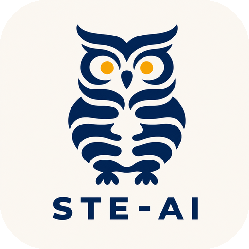

# Structured Technical English for AI

**Clear, consistent, low-cognitive-load writing for AI conversations and documents.**

STE-AI stops AI from burying the answer. It gives agents specific rules for direct replies and maintainable documents.

## Install

🔗 [Installation Instructions](INSTALL.md)

## See the difference

<table>
<tr>
<th width="50%">Typical AI writing</th>
<th width="50%">With STE-AI</th>
</tr>
<tr>
<td valign="top">

> Great question. At its core, this is not just a deployment decision. It is a balance between speed, confidence, and operational readiness. The good news is that 214 tests passed and staging checkout works, which suggests the update is in relatively strong shape.
>
> That said, the failed payment-retry test is worth keeping in mind. It may also be helpful to validate the rollback process before moving forward. Ultimately, taking a thoughtful, measured approach here will help ensure a robust and seamless deployment while minimizing unnecessary risk.

</td>
<td valign="top">

> Do not deploy today.
>
> The failed test leaves payment retries unverified. Untested rollback leaves no verified recovery path.
>
> Verified: 214 tests passed, and staging checkout works.
>
> Next: fix the failed test, then test rollback in staging.

</td>
</tr>
</table>

STE-AI applies the same rules to reports, plans, summaries, and agent instructions such as `SKILL.md` and `AGENTS.md`.

## The rules

### Response rules

1. Lead with the answer, result, recommendation, or next action.
2. Keep lists to five items. Rank or split longer lists.
3. Give no more than two reasons for a recommendation unless the user asks for more.
4. Preserve every risk, caveat, and alternative that can change the decision.
5. Mark uncertainty with one term: `likely`, `unverified`, `unknown`, or `assumed`.

### Language rules

1. Keep sentences to 20 words or fewer. Put one idea in each sentence.
2. Use active voice and the present tense. Use imperative verbs for instructions.
3. Use one stable term for each concept. Define technical terms when they first appear.
4. Use known numbers instead of vague quantities such as “some” or “several.”
5. Remove filler, decorative claims, repeated recaps, and closing invitations.

The complete specification is in [`SKILL.md`](skills/ste-ai/SKILL.md).

## Why this matters

AI instructions work more consistently across models when they use stable terms and explicit rules. This also makes `SKILL.md`, `AGENTS.md`, and related files easier to maintain.

## Inspiration

### ASD-STE100

[ASD-STE100 Simplified Technical English](https://www.asd-ste100.org/) is an international standard for controlled technical writing. Aerospace teams developed it to make maintenance documents easier to understand across languages and organizations.

STE-AI adapts the principle of shared writing constraints for AI communication. It does not reproduce the ASD-STE100 dictionary or claim ASD-STE100 compliance.

STE-AI is independent and is not affiliated with ASD or its STE Maintenance Group. Simplified Technical English and ASD-STE100 are trademarks of ASD, Brussels, Belgium.

### I Have ADHD

The [I Have ADHD](https://github.com/ayghri/i-have-adhd) skill influenced STE-AI’s low-cognitive-load rules and cross-agent distribution format.

## License

[MIT](LICENSE)
